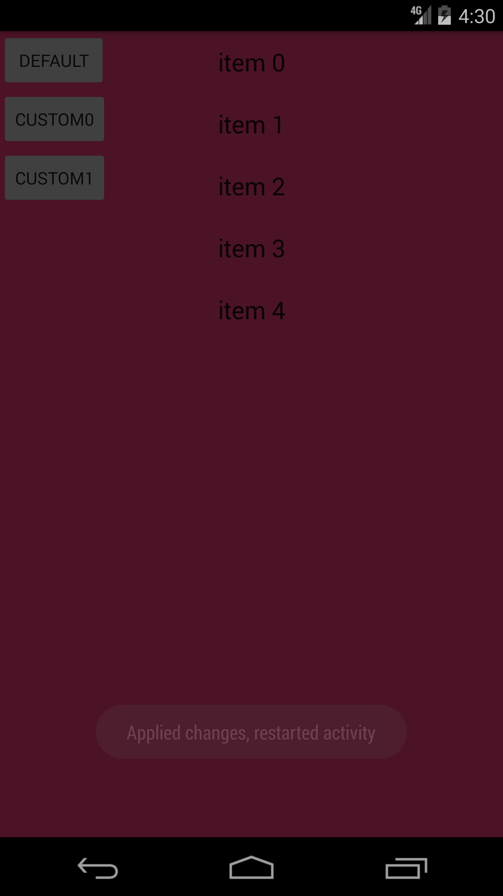
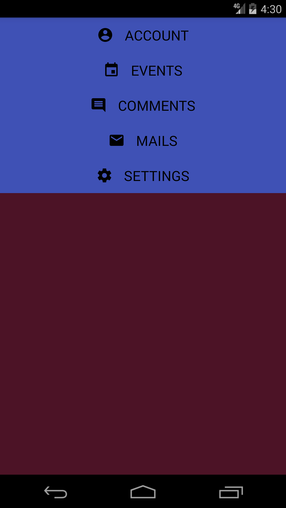
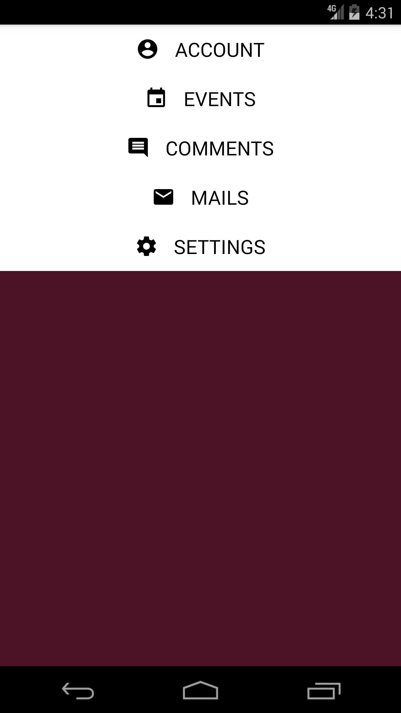

# TopNavigation 

A customizable, easy to use library about top navigation in Android.


## How to Use

### 1.dependency

#### gradle:

**Step 1.** Add the JitPack repository to your build file

```groovy
	allprojects {
		repositories {
			...
			maven { url "https://jitpack.io" }
		}
	}
```

**Step 2.** Add the dependency

```groovy
	dependencies {
	        compile 'com.github.zpauly:TopNavigation:1.0.1'
	}
```

#### maven:

**Step 1.** Add the JitPack repository to your build file

```
	<repositories>
		<repository>
		    <id>jitpack.io</id>
		    <url>https://jitpack.io</url>
		</repository>
	</repositories>
```

**Step 2.** Add the dependency

```
	<dependency>
	    <groupId>com.github.zpauly</groupId>
	    <artifactId>TopNavigation</artifactId>
	    <version>1.0.1</version>
	</dependency>
```

### 2.Use Default TopNavigation

```java
TopNaviagtion mTopNaviagtion = TopNavigationBuilder.withActivity(AppcompatActivity)
  .titles(List<String>) //navigation titles,don't need when you use custom top navigation
  .closableOutside(boolean)//if cancel is permitted when click outside
  .animDuration(long)//set the navigation open and close animator duration
  .build();
```

Use like this, then your top navigation is ready to use.

Now, open it and you will see a default top navigation.

```java
mTopNaviagtion.open();
```



Now, close it.

```java
mTopNaviagtion.close();
```

### 3.Custom

I know the default top navigation doesn't look good. Don't worry, you can use the style you like.

When you want to custom a top navigation, there are only two steps you need to do.

**Step 1.**

Create a class extends RecyclerView.Adapter just like what you do when you create a RecyclerView.

**Step 2.**

Use your adapter like this

```java
mTopNaviagtion.resetAdapter(RecyclerView.Adapter/* your custom adadpter */);
```

At last, you can use your custom top navigation.





### 4.Listener

**1.**If you use default adapter, you can add item click listener like this

```java
mDefaultTopNavigaton.getDefaultAdapter()
  .setOnNavItemClickedListener(new OnNavItemClickedListener() {
        @Override
        public void onClicked(View v, int position) {
        
        }
  });
```

If you use custom adapter, the code above is not needed.

**2.**If you want add opening or closing listener, you can do like this

```java
mDefaultTN.setOnNavStateChangingListener(new OnNavStateChangingListener() {
    @Override
    public void onOpening() {
        
    }
    @Override
    public void onClosing() {

    }
});
```


License
=======


    Copyright 2016 zpauly
    
    Licensed under the Apache License, Version 2.0 (the "License");
    you may not use this file except in compliance with the License.
    You may obtain a copy of the License at
    
       http://www.apache.org/licenses/LICENSE-2.0
    
    Unless required by applicable law or agreed to in writing, software
    distributed under the License is distributed on an "AS IS" BASIS,
    WITHOUT WARRANTIES OR CONDITIONS OF ANY KIND, either express or implied.
    See the License for the specific language governing permissions and
    limitations under the License.

